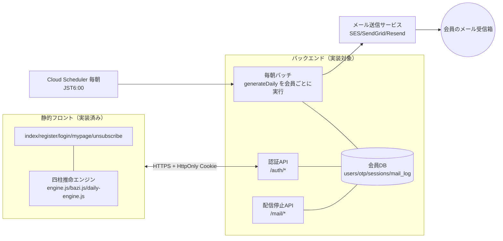
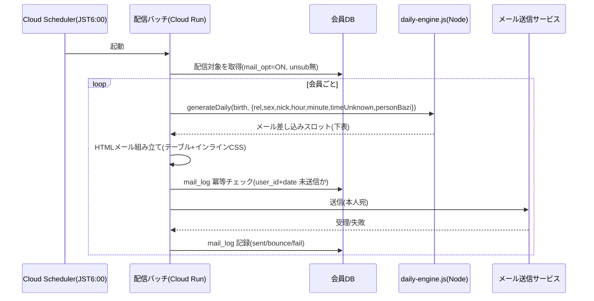

# バックエンド・メール配信 実装仕様書（エンジニア向け・詳細）

- 対象：「私だけの運気予報」（unkiyoho.jp）のバックエンド（認証API・毎朝メール配信・配信停止・会員データ）を実装する人。
- 位置づけ：`00_エンジニア引き継ぎ_はじめにお読みください.md` の詳細版。**メール配信の仕組み**を実装レベルで記述。
- 前提：フロントは実装済み・開発モードで動作中。各HTMLの `UNKIYOHO_AUTH_API_BASE` にAPIのURLを入れれば本番化。
- 環境：Google 系想定（Cloud Run / Cloud Functions / Firebase / Firestore など）。メール送信サービスは差し替え式。

---

## 1. システム構成



- フロントとエンジンは**同一の `daily-engine.js` をブラウザでもNodeでも使う**（＝画面のカレンダーとメールが必ず一致：§11必須契約）。
- 認証は**パスワードレス（メール確認コード/OTP）**。詳細API仕様は `認証設計_引き継ぎ.md`。

---

## 2. 環境変数・設定

| 変数 | 用途 |
|---|---|
| `UNKIYOHO_AUTH_API_BASE`（フロント側・各HTML） | 本番APIのURL。例 `https://api.unkiyoho.jp`。空=開発モード |
| `OTP_PEPPER` | 確認コードのハッシュ用の追加秘密（Secret Manager） |
| `MAIL_PROVIDER_API_KEY` | メール送信サービスのAPIキー |
| `MAIL_FROM` | 送信元 例 `私だけの運気予報 <no-reply@unkiyoho.jp>` |
| `CORS_ORIGIN` | フロントのオリジン（`https://unkiyoho.jp`）。Cookie利用のため `*` 不可 |
| `SESSION_COOKIE`（HttpOnly/Secure/SameSite=Lax） | セッションCookie名 |

---

## 3. 認証API（要約・詳細は認証設計_引き継ぎ.md）

| メソッド | パス | 役割 |
|---|---|---|
| POST | `/auth/request-code` | `{email, purpose, identify?}` 確認コードをメール送信（レート制限・列挙対策・ハッシュ保存） |
| POST | `/auth/verify-code` | `{email, code, remember}` 検証しセッション発行（Set-Cookie） |
| POST | `/auth/logout` | セッション破棄 |
| GET | `/auth/session` | ログイン状態（remember済みは期限をスライディング延長） |
| POST | `/mail/unsubscribe` / `/mail/resubscribe` | `{token}` 配信ON/OFF（ログイン不要・§6） |

- **セキュリティの要**：フロントの localStorage セッションは画面の出し分け(UX)専用。**会員データを返すAPIは必ずサーバーで Cookie セッションを検証**してから返す。
- 参考実装：`../server/`（依存なしで動作。Store=インメモリ、Mailer=コンソール。Firestore/送信サービスに差し替え）。

---

## 4. ★毎朝メール配信の仕組み（本書の主題）

### 4-1. 基本方針
- **固定Nパターンではなく、配信ONの会員数ぶんを「1人1通」生成して送る。** 500人なら500通。
- 各通は**その会員の生年月日から `generateDaily()` で計算生成**。占いの骨格は干支ベースだが**文面は生年月日で個別化**（詳細：`運勢ロジックと配信_エンジニア向け.md`）。

### 4-2. バッチのシーケンス



### 4-3. 生成関数の契約（入力）
```js
const KD = require('./daily-engine.js');       // engine.js を自動 require。bazi.js を同ディレクトリに置く
const { PersonBazi } = require('./bazi.js');

const slots = KD.generateDaily(
  { y: user.birth_y, m: user.birth_m, d: user.birth_d },     // birth（必須）
  { y: 2026, m: 9, d: 14 },                                  // dateJST（省略時は E.todayJST()）
  {
    nick: user.nick, rel: user.rel, sex: user.sex,           // 'single|crush|partner|married|work' / 'f|m'
    hour: user.birth_hour, minute: user.birth_minute,        // 生まれた時間（任意）
    timeUnknown: user.time_unknown !== false,                // 時刻未入力なら true
    personBazi: PersonBazi                                    // ★必ず渡す（喜神/忌神の算出に使用）
    // spread: true（既定。同一日柱の別人でも文面を分散。falseで日柱ベースに戻せる）
  }
);
```
- **`personBazi` を渡し忘れない**：渡さないと喜神/忌神が空（中庸扱い）→ グレードがカレンダーとズレる（§11違反）。
- **JST 固定**（`dateJST` はJSTの年月日。UTCで作らない）。

### 4-4. 生成関数の出力＝メール差し込みスロット（実フィールド）
`generateDaily()` は**HTMLを作らず**、テンプレに差し込む値だけを返す（HTML化はバッチ側の責務）。主なスロット：

| スロット | 内容 | メール内の使い所 |
|---|---|---|
| `subject` | 件名（例「今日の運気の動きを…｜○○」） | メール件名 |
| `user.nick` / `date{y,m,d,wd}` | 宛名・日付 | ヘッダー |
| `relIntro` | 冒頭あいさつ（関係タイプ別・組み合わせ式） | 導入文 |
| `weather{icon,name}` / `index` / `weatherMsg` | 今日の天気・運勢指数・説明 | 天気ブロック |
| `grade{sym,label}` | 💮◎〇△ とラベル | 運勢グレード |
| `theme{god,mean,axis,line,message}` | 十神・主メッセージ | 今日のあなた |
| `todayOne` | **今日の1アクション**（「✅ 今日はこれだけ」枠） | 目立つ1枠 |
| `love` / `loveMove` | 恋愛運・恋の一手 | 恋愛ブロック |
| `en{lv,tag,body}` / `touka` / `special` | 縁・運命の人の日・桃花 | 縁ブロック |
| `fortunes{friend,work,money,health,study}` | 対人/仕事/金/健康/学び運 | 各運ブロック |
| `lucky{color,hex,direction,food,number,item,action,menu[],wear,advice,act,…}` | ラッキー一式・今日の服 | ラッキー枠 |
| `place{direction,nature,city}` | ご縁の場所 | 縁の場所 |
| `koyomi.items[]` | こよみマーク（空亡🌫️/貴人🍀/駅馬🐴/ゆらぎ⚠️/大きく動く🌀。各 `{emoji,label,text,tone}`） | こよみ |
| `moon{name,emoji,text}` / `kou` / `season{sekki,yomi,word,food,wear}` | 月相・七十二候・季節 | 暦の一言 |
| `juni{stage,text}` / `element{…}` / `bazi` | 十二運・五行・喜忌 | 補足 |
| `habit` / `onepoint` / `morning` | 開運習慣・今日の一言・朝の習慣 | コラム |
| `closeWord` | 締めの言葉（組み合わせ式） | フッター直前 |

> `koyomi.items` は**カレンダーと同一表引き**（`koyomiOf`）。年月柱冲🌀は `personBazi` がある時のみ算出。

### 4-5. HTMLメール化の必須事項
- **テーブルレイアウト＋インラインCSS**へ移植（Gmail等が `<style>`/grid を削るため）。見た目の目標は `mail-sample.html`（Web用CSSなので構造の参考に）。
- 画像は絶対URL（`https://unkiyoho.jp/...`）。ダークモード対応は任意。
- **法定フッター（特定電子メール法・必須）**：
  - 機能する**配信停止URL**（受信者ごとの解除トークン付き `https://unkiyoho.jp/unsubscribe.html?token=XXXX`／ログイン不要ワンクリック）
  - 設定変更（マイページ）リンク
  - 事業者名・住所・問い合わせ（72k株式会社／info@72k.ai）
- 末尾に「1.66相性診断への導線＋シェア（LINE/X）」ブロック。`example.com` を本番URLへ。

### 4-6. 運用要件（非機能）
- **スケジュール**：Cloud Scheduler で毎日 **JST 6:00 までに完了**（「起きたら届いている」）。逆算して開始（例 5:30）。
- **冪等性**：`mail_log` に `user_id + date` のユニーク制約。送信前に「その日・その人が未送信か」を確認し、**二重送信を防ぐ**（再実行・リトライで重複しない）。
- **スループット/レート**：送信サービスのクォータに合わせて分割・並列。生成は軽量（ms級）なので律速は送信側。大規模時はキュー（Pub/Sub）＋ワーカー。
- **失敗・バウンス**：`mail_log.status` に sent/bounce/fail。恒久バウンスが続くアドレスは自動で `mail_opt=OFF`（配信除外）にする運用を推奨。
- **タイムゾーン**：全処理 JST。`dateJST` もJST。
- **到達率**：送信元 `unkiyoho.jp` の **SPF / DKIM / DMARC** を必ず設定。共有IPよりドメイン認証が重要。

---

## 5. 配信停止（ログイン不要・法令必須）

- 各メールの「配信停止」＝受信者ごとの**解除トークン付きURL**（`unsubscribe.html?token=XXXX`）。ワンクリックで確実に停止。
- ページは同梱済み。本番は `token` を `/mail/unsubscribe`（→ `mail_opt=false`）へ。`/mail/resubscribe` で再開。
- マイページのトグル（`#swMail`）も同じ `mail_opt` を読み書き（フロントは `unkiyoho_mail_opt` で連動済み。サーバーの `mail_opt` と同期）。

---

## 6. データモデル（Firestore/RDB 相当・詳細）

```
users
  id (uniq), email (uniq, 正規化=trim+小文字), nick,
  birth_y, birth_m, birth_d, birth_hour(null可), birth_minute(null可), time_unknown(bool),
  sex('f'|'m'), pref, rel('single'|'crush'|'partner'|'married'|'work'), interests(json),
  mail_opt(bool), minor_consent(bool), consent_at(timestamp), created_at, updated_at

otp        // 短命・TTL自動削除推奨
  email(key), code_hash(平文保存禁止), purpose('login'|'register'|'change-email'),
  expires_at(=now+10分), attempts(上限5), sent_at(再送クールダウン判定)

sessions
  token(key), user_id, remember(bool), expires_at, created_at, user_agent(任意)

mail_log
  id, user_id, date(YYYY-MM-DD), channel('email'|'line'), status('sent'|'bounce'|'fail'),
  sent_at  // ★(user_id, date, channel) をユニークにして冪等性を担保

unsub_token
  user_id, token(uniq)   // ワンクリック配信停止用（トークン→user解決）
```
- 会員データは **user_id に紐づけ**、email は1属性（メール変更でデータを失わない）。
- 生年月日・時刻は要配慮に準じる個人情報。保存時暗号化・アクセス制御を厳格に。同意・解約の記録は消さない。

---

## 7. 実装ステップ

1. 会員DB・スキーマ作成（§6）。
2. 認証API 4本＋`/mail/*`（`認証設計_引き継ぎ.md` ／ `server/` を移植）。CORSはオリジン限定＋credentials許可。
3. メール送信サービス契約＋SPF/DKIM/DMARC。テンプレ（テーブル＋インラインCSS）作成。
4. 毎朝バッチ：`daily-engine.js` を Node 流用 → `personBazi` を渡して `generateDaily` → HTMLメール → 送信 → `mail_log`。冪等・リトライ・バウンス処理。
5. Cloud Scheduler で JST 早朝に起動。
6. 各HTMLの `UNKIYOHO_AUTH_API_BASE` に本番URLを設定（login/register/mypage/unsubscribe）。
7. 登録フォーム送信先（`register.html` の `GFORM` プレースホルダ）を自前API化。`consent_at`・各同意を保存。
8. §8 契約テスト → OGP/導線URLの `example.com` 差し替え → 本番ドメイン切替。

---

## 8. 品質・契約テスト（必須）

- **メール＝カレンダー一致（§11 必須契約）**：同一 `birth` に対し、バッチが出す `grade/index/koyomi` と、画面（`mypage.html` / `my-tenki-demo.html`）が出す値が**完全一致**すること。CIで突合テストを置く。
- 一致のカギ：**同一バージョンの `bazi.js`/`engine.js`/`daily-engine.js` を使う**・`personBazi` を渡す・`YM_SCALE=0.6` を変えない・JST基準。

---

## 9. 触ってはいけないもの（禁止・不変）

- ❌ `engine.js` / `bazi.js` / `daily-engine.js` の計算・定数・シード・**プール長**の改変（暦周期と互いに素に設計。全画面がズレる）。
- ❌ グレード定数・判定順・`YM_SCALE=0.6` の変更。
- ❌ 毎朝メールを別ロジック/別バージョンのエンジンで生成すること。
- ❌ UTCで「今日」を判定すること（JST固定）。
- ❌ 会員種別（無料/有料）の分岐・決済フローの実装（現行は全員フル・完全無料）。

---

### まとめ（1行）
**Cloud Scheduler → 配信バッチが、配信ONの会員を回して `generateDaily(birth,{…,personBazi})` で1人1通を生成し、テーブル化HTMLメールにして送信。冪等は mail_log(user_id,date)。認証はメール確認コード。エンジンは変更しない。**
